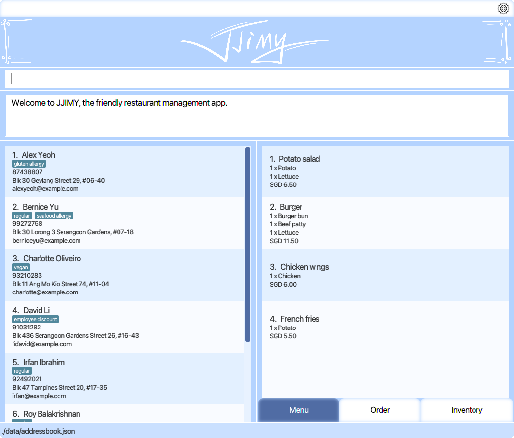

JJIMY is a **desktop app for managing your restaurant, optimized for use via a Command Line Interface** (CLI) while still having the benefits of a Graphical User Interface (GUI). If you can type fast, JJIMY can get your restaurant management tasks done faster than traditional GUI apps.

* Table of Contents
{:toc}

--------------------------------------------------------------------------------------------------------------------

## Quick start

1. Ensure you have Java `11` or above installed in your Computer.

2. Download the latest `JJIMY.jar` from here.

3. Copy the file to the folder you want to use as the _home folder_ for JJIMY.

4. Double-click the file to start the app. The GUI similar to the below should appear in a few seconds. Note how the app contains some sample data.<br>
   

5. Type in command in the command box and press Enter to execute it.

6. Refer to the [Features](#features) below for command details.

--------------------------------------------------------------------------------------------------------------------

## Features

### General

#### `help` - Access help page
Format: `help`

#### `exit` - Exit application
Format: `exit`

### `contacts`

#### `list` - List all contacts
Format: 
```
contacts list
```

#### `add` - Add a contact
Format: 
```
contacts add n/[NAME] p/[PHONE_NUMBER] e/[EMAIL] a/[ADDRESS]
```

#### `delete` - Delete contact
Format:
```
contacts delete [INDEX] [-f]
```

In the event that there are unfulfilled orders by the contact that is being attempted to be deleted, a `-f` flag has to be added to the end of the command to confirm the command. This is to prevent you from accidentally deleting orders unknowingly and leading to unhappy customers!

#### `find` - Find contact
Format:
```
contacts find n/[KEYWORD] [MORE KEYWORDS]
```

### `menu`

#### `list` - List all dishes
Format: 
```
menu list
```

#### `add` - Add a dish
Format: 
```
menu add n/[NAME] p/[PRICE]  
```

#### `delete` - Delete a dish from the menu
Format:
```
menu delete [INDEX]
```

#### `find` - Find dish
Format:
```
menu find [KEYWORD] [MORE KEYWORDS]
```

### `orders`

#### `list` - List all orders
Format: 
```
orders list
```

#### `add` - Add an order
Format: 
```
orders add n/[CUSTOMER_NAME] dt/[DELIVERY_DATETIME] (DD-MM-YYYY HH:MM) d/[DISH_NAME] q/[QUANTITY]...  
```

#### `delete` - Delete an order
Format:
```
orders delete [INDEX]
```

#### `find` - Find an order
Format:
```
orders find [KEYWORD] [MORE KEYWORDS]
```

### `inventory`

#### `list` - List all items
Format: 
```
inventory list
```

#### `add` - Add an item
Note:
If the ingredient already exists, its listed quantity will be incremented.

Format: 
```
inventory add n/[INGREDIENT_NAME] q/[QUANTITY]
```

#### `decrease` - Decrease quantity of item
Format:
```
inventory decrease [INDEX] [QUANTITY]
```

#### `delete` - Delete an item
Format:
```
inventory delete [INDEX]
```

#### `find` - Find an item
Format:
```
inventory find n/[KEYWORD] [MORE KEYWORDS] q/[LESS THAN QUANTITY]
```


--------------------------------------------------------------------------------------------------------------------

## FAQ

In progress

--------------------------------------------------------------------------------------------------------------------
